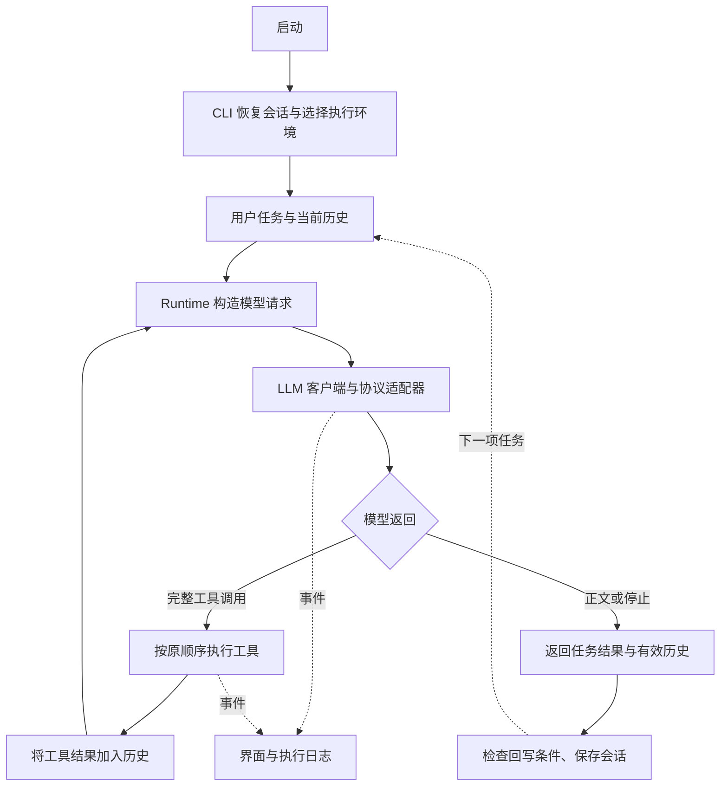

# 项目架构

[返回 README](README.md) · [开发指南](docs/development.md)

本文描述当前代码结构。入口是 `repo-agent`，模型请求和会话管理运行在宿主机；默认使用 macOS / Linux native 后端直接编辑项目，可显式选择 local 或 Docker。

## 模块职责

| 模块 | 主要文件 | 职责 |
| --- | --- | --- |
| 命令入口 | [cli/main.py](cli/main.py)、[cli/settings.py](cli/settings.py) | 分发命令、加载参数、选择项目和执行环境 |
| 交互界面 | [cli/tui.py](cli/tui.py)、[cli/interactive.py](cli/interactive.py)、[cli/live.py](cli/live.py) | 全屏/普通终端、流式显示、用量和上下文状态 |
| 会话管理 | [agent/session.py](agent/session.py)、[cli/session.py](cli/session.py)、[cli/sessions_command.py](cli/sessions_command.py) | 项目隔离、快照、名称索引、恢复、会话查询和日志查看 |
| 对话显示记录 | [cli/transcript.py](cli/transcript.py) | 保存可见文本与思考区块，独立于模型原生历史 |
| Agent 循环 | [agent/runtime.py](agent/runtime.py) | 构造请求、顺序执行工具、截断恢复、返回有效历史 |
| Skills | [agent/skills/registry.py](agent/skills/registry.py)、[agent/skills/tool.py](agent/skills/tool.py) | 发现并校验技能，显式或按需加载正文 |
| 模型层 | [llm/client.py](llm/client.py)、[llm/schemas.py](llm/schemas.py)、[llm/adapters/](llm/adapters/) | 同步/异步调用、流式解析、协议转换、原生状态和错误 |
| 模型能力 | [llm/model_limits.py](llm/model_limits.py)、[llm/thinking_profiles.py](llm/thinking_profiles.py)、[llm/thinking_catalog.py](llm/thinking_catalog.py) | 上下文元数据查询、思考能力匹配与校验 |
| 工具 | [tools/factory.py](tools/factory.py)、[tools/](tools/) | 文件、补丁、搜索、Git、环境查询、隔离命令、Python 和语言服务器工具 |
| Web 工具 | [tools/web_tools.py](tools/web_tools.py)、[tools/_internal/](tools/_internal/) | 主进程受控搜索、网页抓取和分页缓存，按配置启用 |
| 系统提示词 | [agent/prompt.py](agent/prompt.py) | 通用任务规则；代码工作流程由 `coding` 等技能按需补充 |
| 原生沙箱 | [sandbox/native.py](sandbox/native.py)、[sandbox/linux_native.py](sandbox/linux_native.py)、[sandbox/linux_gpu.py](sandbox/linux_gpu.py) | 平台隔离、原项目执行、Linux/WSL2 GPU 授权与驱动自检 |
| Docker 沙箱 | [sandbox/session.py](sandbox/session.py)、[sandbox/docker.py](sandbox/docker.py)、[sandbox/writeback.py](sandbox/writeback.py) | 工作副本、容器、回写检查、备份与恢复 |
| 追踪 | [agent/Tracing.py](agent/Tracing.py) | 模型/工具事件、计时、任务与运行片段统计 |
| 配置与安装 | [cli/config.py](cli/config.py)、[cli/config_command.py](cli/config_command.py)、[cli/setup.py](cli/setup.py)、[cli/uninstall.py](cli/uninstall.py) | 配置加载及备份、安装、诊断、归属清理 |

## 一次任务的流程

显式选择 local 模式时，直接创建文件、Git 和不启动子进程的基础环境查询工具，不注册命令、Python 或语言服务器工具。Docker 工具代理为每次调用创建独立容器，只挂载工作副本。`sandbox/native.py` 根据平台选择后端：macOS 使用 Seatbelt，Linux 的 `sandbox/linux_native.py` 使用 Bubblewrap namespace 和只读/遮蔽挂载，`sandbox/linux_exec.py` 在执行前加载 seccomp。命令和 worker 都直接操作原项目，复用工具协议，不使用副本回写。模型请求在宿主机发送，隔离 worker 不持有模型凭证。可选 Web 工具也在主进程单独注册，不进入沙箱工具工厂；Web 联网不改变命令断网策略。

## 上下文构造

1. `AgentRuntime.run(task, history=...)` 复制调用方传入的历史，空历史时加入系统提示词，再加入本次用户任务。
2. 启用 Skills 时，请求中临时注入技能目录；显式指定或 `load_skill` 成功后，技能正文进入消息历史。
3. 模型的完整 assistant 消息通过 `to_message()` 保留原生状态；工具结果按调用顺序追加，然后再次请求模型。
4. CLI 在任务边界保存有效历史；重启恢复时更新系统提示词并按模型身份处理原生状态，再传回 Runtime。Runtime 库本身不自动创建磁盘会话。

当前没有自动摘要或压缩。界面累计用量是多次请求用量之和；上下文占用在请求前可使用本地粗估，收到服务端用量后按最近一次请求估算，两者不是同一个数值，见[上下文占用估算](docs/usage.md#上下文占用估算)。

## 状态与文件归属

| 数据 | 所在位置 | 更新方式 |
| --- | --- | --- |
| 用户配置、思考偏好 | 用户配置目录中的 `.env`、`thinking.json` | 配置命令或交互设置保存 |
| 会话恢复状态 | 用户状态目录中的 `<项目哈希>/<会话ID>.json` | 任务边界原子替换快照 |
| 名称和序号 | 同项目目录下的 `index` | 独立短时锁保护；外部改名不会被旧快照覆盖 |
| 默认恢复目标 | 同项目目录下的 `latest.json` | 指向最近保存的会话 |
| 连续会话日志 | `<项目哈希>/<会话ID>/` | `chat.log`、`trace.log`、`trace.jsonl` 持续追加 |
| 单次运行片段日志 | 项目 `logs/` 或 `AGENT_LOG_DIR` | 每次启动或 `/new` 创建新的追踪文件 |
| 沙箱工作副本与回写备份 | 系统临时目录 `repo-agent-sandbox-*` | 文件保留，容器进程不保留 |

完整路径及恢复边界见[会话管理](docs/sessions.md)。执行日志使用持久化 `session_id` 和每次运行片段的 `run_id`；日志不是用于恢复模型上下文的快照。

同项目只允许一个 Agent 执行会话；列表、日志读取和外部改名不获取这把长期执行锁。会话切换不等于文件版本切换：界面内 `/new` 继续使用当前工作副本。

## 当前边界

检索由文件查找、内容搜索和语言服务器符号工具完成；没有独立向量检索或 Embedding 管线。会话恢复保存原有上下文，没有跨会话知识提炼或独立长期 memory 模块。MCP 集成、规划器、多 Agent 协作、并行工具执行和任务费用预算也不属于当前实现。
