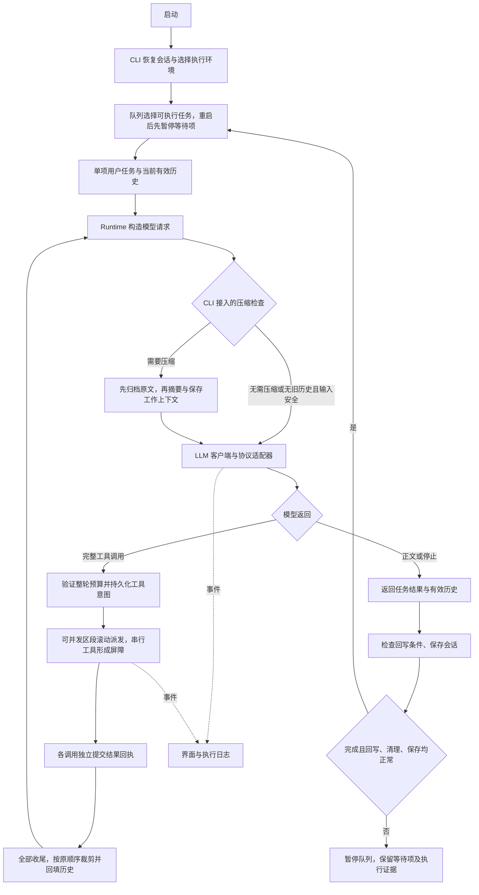

# 项目架构

[文档首页](docs/index.md) · [项目首页](README.md) · [开发指南](docs/development.md)

本文描述当前代码结构。入口是 `repo-agent`，模型请求和会话管理运行在宿主机；macOS/Linux 首次安装默认 native，Windows x86_64 首次安装默认 local，可显式选择 Docker。Windows 的文件与安装适配已实现，未提供 Windows 原生沙箱。

## 模块职责

| 模块 | 主要文件 | 职责 |
| --- | --- | --- |
| 宿主平台服务 | [host_support/](host_support/)、[平台适配边界](docs/platform-adaptation.md) | 平台标识、目录和解释器布局、文件操作、锁、原子写入、进程生命周期与诊断；默认标准库实现，可选 Rust 文件系统适配器延迟加载 |
| Windows 适配 | [host_support/windows_files.py](host_support/windows_files.py)、[host_support/windows_install.py](host_support/windows_install.py)、[install_release.ps1](install_release.ps1) | 句柄相对文件操作、文件锁、用户命令归属与 PATH、ZIP 运行时引导；不提供原生进程隔离 |
| 命令入口 | [cli/main.py](cli/main.py)、[cli/arguments.py](cli/arguments.py)、[cli/commands.py](cli/commands.py)、[cli/startup.py](cli/startup.py) | 装配入口、参数校验、独立子命令和配置启动流程 |
| 应用装配 | [cli/application.py](cli/application.py)、[cli/execution_environment.py](cli/execution_environment.py)、[cli/runtime_setup.py](cli/runtime_setup.py) | 后端与 Runtime 装配、交互/单任务执行、保存和资源生命周期 |
| 交互界面 | [cli/terminal/](cli/terminal/)、[cli/interactive.py](cli/interactive.py)、[cli/output.py](cli/output.py) | 全屏/普通终端、流式展示 |
| 会话控制 | [agent/session_state.py](agent/session_state.py)、[agent/thinking.py](agent/thinking.py) | 用量与上下文统计、思考设置校验和提交；不依赖 CLI 或终端组件 |
| 交互执行适配 | [cli/runtime_events.py](cli/runtime_events.py)、[cli/task_execution.py](cli/task_execution.py) | Runtime 事件快照、回调生命周期、后台任务与回写衔接 |
| 会话管理 | [agent/session.py](agent/session.py)、[agent/conversation.py](agent/conversation.py)、[cli/sessions_command.py](cli/sessions_command.py) | 项目隔离、快照、名称索引、恢复、会话查询和日志查看 |
| 对话显示记录 | [agent/transcript.py](agent/transcript.py) | 保存可见文本与思考区块，独立于模型原生历史，不依赖终端组件 |
| Agent 循环 | [agent/runtime.py](agent/runtime.py) | 构造请求、调用工具调度器、输出预算裁剪、截断恢复、返回有效历史 |
| Skills | [agent/skills/registry.py](agent/skills/registry.py)、[agent/skills/tool.py](agent/skills/tool.py) | 发现并校验技能，显式或按需加载正文 |
| 模型层 | [llm/client.py](llm/client.py)、[llm/schemas.py](llm/schemas.py)、[llm/adapters/](llm/adapters/) | 同步/异步调用、流式解析、协议转换、原生状态和错误 |
| 上下文压缩 | [agent/compaction.py](agent/compaction.py)、[agent/history.py](agent/history.py)、[llm/independent.py](llm/independent.py) | 请求前自动检查、手动压缩、独立摘要请求、原文归档与只读回查 |
| 摘要校验与诊断 | [agent/compaction_summary.py](agent/compaction_summary.py)、[agent/compaction_diagnostics.py](agent/compaction_diagnostics.py) | 短引用映射、结构与来源校验、每次失败摘要至多一次格式修复、独立失败候选记录 |
| 模型能力 | [llm/model_limits.py](llm/model_limits.py)、[llm/thinking_profiles.py](llm/thinking_profiles.py)、[llm/model_catalog.py](llm/model_catalog.py) | 上下文元数据查询、思考能力匹配与校验 |
| 工具 | [tools/factory.py](tools/factory.py)、[tools/](tools/) | 文件、补丁、搜索、Git、环境查询、隔离命令、Python 和语言服务器工具 |
| 工具调度与分组 | [agent/tool_scheduler.py](agent/tool_scheduler.py)、[tools/dispatch.py](tools/dispatch.py)、[tools/scheduling.py](tools/scheduling.py)、[tools/tool_groups.py](tools/tool_groups.py) | 滚动并发、串行屏障和取消收尾；校验执行边界；按需加载工具定义 |
| 任务队列 | [agent/task_queue.py](agent/task_queue.py)、[cli/task_controller.py](cli/task_controller.py) | 会话内单消费者调度、暂停、重试与续接；结果保存成功后推进下一项 |
| 执行证据与结果回读 | [agent/execution_ledger.py](agent/execution_ledger.py)、[agent/tool_results.py](agent/tool_results.py)、[agent/result_refs.py](agent/result_refs.py) | 工具意图、开始、回执持久化及崩溃核查；按会话引用读取已保存结果 |
| Web 工具 | [tools/web_tools.py](tools/web_tools.py)、[tools/_internal/](tools/_internal/) | 主进程受控搜索、网页抓取、分页缓存和快照内关键词查找，按配置启用 |
| 系统提示词 | [agent/prompt.py](agent/prompt.py) | 通用任务规则；代码工作流程由 `coding` 等技能按需补充 |
| 原生沙箱 | [sandbox/native.py](sandbox/native.py)、[sandbox/native_common.py](sandbox/native_common.py)、[sandbox/macos_native.py](sandbox/macos_native.py)、[sandbox/linux_native.py](sandbox/linux_native.py) | 显式选择后端、共享调用生命周期、各平台隔离策略与实际自检 |
| 策略扫描 | [sandbox/policy_scan.py](sandbox/policy_scan.py)、[sandbox/policy_scanners.py](sandbox/policy_scanners.py)、[sandbox/rust_policy.py](sandbox/rust_policy.py) | Linux 策略扫描批量协议；默认 Python，可显式选择已安装的 Rust 扩展；每次重新观察文件系统 |
| Rust 基础能力 | [rust/](rust/)、[host_support/rust_filesystem.py](host_support/rust_filesystem.py) | `rust-backend` 平台扩展：Linux 策略扫描、macOS 工作区预检、两平台 native 文件工具的目录访问和批量元数据；Python 继续执行工具策略与文本匹配 |
| 目录与文本扫描 | [host_support/file_scan.py](host_support/file_scan.py)、[host_support/path_rules.py](host_support/path_rules.py)、[tools/_internal/text_search.py](tools/_internal/text_search.py) | 目录作用域读取、名称匹配与惰性分行；工具层保留权限、预算和输出协议 |
| 项目 Python | [sandbox/project_python.py](sandbox/project_python.py) | 选择项目解释器、构造读取范围和项目进程环境；可信 worker 继续使用 Agent Python |
| Docker 沙箱 | [sandbox/session.py](sandbox/session.py)、[sandbox/docker.py](sandbox/docker.py)、[sandbox/writeback.py](sandbox/writeback.py) | 工作副本、容器、回写检查、备份与恢复 |
| 追踪 | [agent/Tracing.py](agent/Tracing.py) | 模型/工具事件、计时、任务与运行片段统计 |
| 构建与分发 | [build_manifest.py](build_manifest.py)、[build_support.py](build_support.py)、[scripts/build_release.py](scripts/build_release.py) | 统一文件清单、生成构建配置、校验 wheel / sdist / Docker 上下文与发行包 |
| 配置服务 | [configuration/environment.py](configuration/environment.py)、[configuration/storage.py](configuration/storage.py)、[cli/config_command.py](cli/config_command.py) | 配置加载、保存与备份由 configuration 管理；参数交互与校验命令由 CLI 装配 |
| 安装与分发服务 | [installer/](installer/)、[cli/doctor.py](cli/doctor.py) | 安装、卸载、依赖、事务、配置模板合并、可选 Rust 构建/安装及发行清单；诊断命令由 CLI 汇总 |
| 受管运行时与离线材料 | [runtime/python.lock](runtime/python.lock)、[scripts/bootstrap-python.sh](scripts/bootstrap-python.sh)、[scripts/prepare_python_bundle.py](scripts/prepare_python_bundle.py) | 固定平台 Python 归档与校验值、引导运行时、准备平台依赖；源码安装另包含开发依赖 |

## 一次任务的流程

目录归属、依赖约束和安装兼容入口见[代码组织](docs/code-organization.md)。`cli` 保留命令装配与终端交互，`agent` 和 `sandbox` 不再导入 CLI；安装引导只使用 `installer`、`configuration.storage` 和宿主标准库服务。

显式选择 local 模式时，直接创建文件、Git 和不启动子进程的基础环境查询工具，不注册命令、Python 或语言服务器工具。Docker 工具代理为每次调用创建独立容器；会话目录中只开放工作副本，另以只读文件传入本次调用请求。

native 直接操作原项目，不使用副本回写。内置文件工具通过受约束的轻量文件服务执行；命令、Python、Git、环境探测和 LSP 使用操作系统隔离。`sandbox/native.py` 根据平台选择后端：macOS 使用 Seatbelt；Linux 的 `sandbox/linux_native.py` 使用 Bubblewrap namespace 和只读/遮蔽挂载，`sandbox/linux_exec.py` 在执行前加载 seccomp。Linux 复用配置级策略计划，每次执行重新扫描文件系统；同次扫描合并工作区元数据检查并复用目录别名结果。WSL GPU 的驱动挂载识别与所需驱动目录选择由 `linux_mounts.py`、`wsl_drivers.py` 和隔离探测配合完成。细节及限制见[原生沙箱](docs/native-sandbox.md)。

Agent 安装默认使用受管 Python；native 可另选项目 Python 执行用户代码和探测依赖。可信 worker、控制进程与语言服务器的运行环境保持独立，Python LSP 通过分析环境配置访问项目依赖，见[Python 环境](docs/python-environments.md)。模型请求在宿主机发送，隔离 worker 不持有模型凭证。可选 Web 工具也在主进程单独注册，不进入沙箱工具工厂；Web 联网不改变命令断网策略。

Runtime 按 `ExecutionKind` 校验执行边界，按独立的 `SchedulingPolicy` 决定并发。相邻可并发调用组成区段，默认最多 4 个在途调用，完成后滚动补位；整个区段收尾后才越过串行屏障，结果按原调用顺序回填历史。CLI 默认只向模型公开通用工具与加载器，`file_editing`、`coding` 两组通过 `load_tool_group` 按需加载；加载状态随会话保存，不能增加当前后端未授权的能力。完整边界见[工具调度](docs/tools.md#工具执行调度)与[工具组](docs/tools.md#按需加载工具组)。

平台公共服务集中在 `host_support`，不依赖 Agent、CLI、工具或沙箱业务模块。默认路径只需要标准库；显式选择 Rust 后由适配器延迟导入 `rust_backend`。安装引导和恢复可在未加载第三方依赖时导入它；文件工具为共享文件机制注入工作区策略。会话、Skills、配置与 Docker 回写按需复用文件描述符、锁或原子替换机制，工具、LSP 和安装下载共享进程生命周期机制，并保留各自协议与环境策略。

`sandbox/native.py` 的 `create_native_backend` 显式选择后端；macOS 与 Linux 共同继承 `native_common.NativeBackendBase`，Linux 不继承 macOS 策略。`macos_native.py` 保留 Seatbelt 实现，Linux 的挂载、seccomp、GPU 与 WSL 专用模块保持独立。平台识别和能力描述不授予执行权限，也不表示 Windows 原生执行已得到支持。详见[平台适配边界](docs/platform-adaptation.md)。

取消使用每次任务独立的协作上下文，模型/网络等待和子进程清理响应同一停止请求；只读文件调用可在遍历和读取检查点取消，修改调用先完成安全边界内的提交及回执，已提交修改不自动撤销。TUI 后台线程通过事件队列投递文本、思考和进度，UI 在任务结果收尾时排空队列后保存显示记录。此事件队列只用于界面通知；另有随会话快照保存的 `TaskQueue` 管理用户任务，任务仍逐项执行。取消、错误、轮数耗尽或清理未确认均暂停后续任务；重启不会自动重跑中断项。实现与清理状态含义见[取消协议](docs/development.md#每次任务的取消协议)。

## 上下文构造

1. `AgentRuntime.run(task, history=...)` 复制调用方传入的历史，空历史时加入系统提示词，再加入本次用户任务。
2. 启用 Skills 时，请求中临时注入技能目录；显式指定或 `load_skill` 成功后，技能正文进入消息历史。
3. 模型的完整 assistant 消息通过 `to_message()` 保留原生状态；工具结果按调用顺序追加，然后再次请求模型。
4. CLI 的 `SavedConversation` 将 `ContextCompactor.before_request` 接入 Runtime，每次正常模型请求前检查完整输入预算（含工具、技能），必要时先归档原文，再以摘要、用户原文和近期消息替换工作上下文。也可用 `/compact` 手动触发。没有可压缩旧历史且输入仍在安全预算内时，自动检查直接放行。
5. CLI 在任务边界、自动压缩前的检查点及压缩提交时保存有效历史；重启恢复时更新系统提示词并按模型身份处理原生状态，再传回 Runtime。Runtime 库本身只提供 `before_request` 回调，不自动装配压缩器或创建磁盘会话。

默认自动触发比例为 0.75，压缩目标为 0.45，均相对于可用输入预算；CLI 从 `CompactionSettings` 读取同一套默认值。摘要采用目录的独立思考设置和输出额度策略；完整流程见[上下文压缩与历史回查](docs/context-compaction.md)。界面累计用量是多次请求用量之和；上下文占用在请求前可使用本地粗估，收到服务端用量后按最近一次请求估算，两者不是同一个数值，见[上下文占用估算](docs/usage.md#上下文占用估算)。

## 状态与文件归属

| 数据 | 所在位置 | 更新方式 |
| --- | --- | --- |
| 用户配置、思考偏好 | 用户配置目录中的 `.env`、`thinking.json` | 配置命令或交互设置保存 |
| 会话恢复状态 | 用户状态目录中的 `<项目哈希>/<会话ID>.json` | 任务边界、自动压缩前及压缩提交时原子替换；含工作上下文、压缩元数据与累计用量 |
| 持久化任务队列 | 会话快照中的 `task_queue` | 入队、编辑、领取和收尾时保存；重启恢复等待项为暂停状态 |
| 工具执行账本 | 同项目状态目录下的 `execution.sqlite3` | 意图、开始和回执分别提交事务；`ledger_cursor` 关联会话检查点 |
| 未完成会话提交 | 同项目目录下的 `.pending-save` | 先记录递增 `commit_revision`，再发布快照、索引和最新指针；下次持锁访问时修复 |
| 压缩原文归档 | 同项目状态目录下的 `history.sqlite3` | 压缩前提交完整有序快照；内容可去重，消息出现顺序保留 |
| 压缩失败诊断 | `<项目哈希>/<会话ID>/compaction-diagnostics/<诊断ID>.json` | 保存失败候选和引用映射；普通日志只记录错误信息和诊断 ID，不自动清理 |
| 用户原文出现记录 | 会话压缩元数据 `pins` | 按出现顺序保存原文引用和 `occurrence`（快照 ID＋位置）；相同文本的再次更正仍保留 |
| 名称和序号 | 同项目目录下的 `index` | 独立短时锁保护；外部改名不会被旧快照覆盖 |
| 默认恢复目标 | 同项目目录下的 `latest.json` | 指向最近保存的会话 |
| 连续会话日志 | `<项目哈希>/<会话ID>/` | `chat.log`、`trace.log`、`trace.jsonl` 持续追加 |
| 单次运行片段日志 | 项目 `logs/` 或 `AGENT_LOG_DIR` | 每次启动或 `/new` 创建新的追踪文件 |
| 沙箱工作副本与回写备份 | 系统临时目录 `repo-agent-sandbox-*` | 文件保留，容器进程不保留 |

完整路径及恢复边界见[会话管理](docs/sessions.md)。执行日志使用持久化 `session_id` 和每次运行片段的 `run_id`；日志不是用于恢复模型上下文的快照。

同项目只允许一个 Agent 执行会话；列表、日志读取和外部改名不获取这把长期执行锁。会话切换不等于文件版本切换：界面内 `/new` 继续使用当前工作副本。

## 当前边界

检索由文件查找、内容搜索和语言服务器符号工具完成；没有独立向量检索或 Embedding 管线。会话恢复保存原有上下文，没有跨会话知识提炼或独立长期 memory 模块。MCP 集成、独立规划器、多 Agent 协作和任务费用预算也不属于当前实现。单项任务内已支持受策略约束的工具并发；CLI 队列和同一 Runtime 的任务仍串行。

会话快照保存有效上下文，账本保存执行证据，两者不能将外部文件和命令副作用纳入同一个事务。外部效果已发生而回执尚未落盘时仍需人工核实，不自动重放或回滚。`read_tool_result` 只能回读已保存内容，不能找回原工具采集时已丢弃的输出；Web 缓存则仅存活于当前后端，不能靠会话恢复重新读取过期网页引用。
