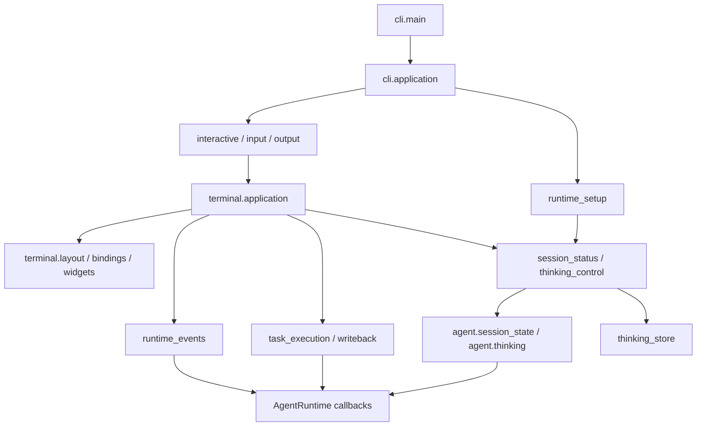

# 代码组织与依赖边界

[文档首页](index.md) · [项目架构](../Project_Architecture.md) · [开发指南](development.md)

`cli/` 负责命令入口、交互和对象装配。安装服务、配置读写、会话协调具有独立归属，其他模块不应为了复用这些能力而导入 CLI。

## 目录归属

| 目录 | 职责 | 主要入口 |
| --- | --- | --- |
| `cli/` | 解析命令、终端交互、展示、装配运行环境 | `main.py`、`interactive.py`、`terminal/application.py` |
| `installer/` | 安装/卸载、依赖准备、资源定位、发行校验和安装事务 | `setup.py`、`uninstall.py`、`release_install.py` |
| `configuration/` | 配置环境加载、保存、备份与恢复 | `environment.py`、`storage.py` |
| `agent/` | Agent 循环、会话持久化与协调、压缩、Skills、追踪 | `runtime.py`、`session.py`、`conversation.py` |
| `host_support/` | 标准库实现的宿主文件、锁、路径与进程机制 | `filesystem.py`、`locking.py`、`storage.py` |

模型协议、具体工具、执行隔离仍分别归属 `llm/`、`tools/`、`sandbox/`。不要把业务策略为了“共享”而继续下沉到 `host_support`。

### CLI 内的文件

| 文件 | 当前职责 |
| --- | --- |
| `main.py` | 装配入口：连接命令路由、配置作用域、校验和应用调用；将错误转为退出码 |
| `arguments.py`、`settings.py` | CLI 参数定义、默认值和跨参数校验 |
| `commands.py` | 独立子命令路由，以及保留沙箱的查看、回写和恢复 |
| `startup.py` | 项目配置作用域、初始模型向导与模型配置转换 |
| `execution_environment.py` | local/native/Docker 环境准备与后端资源登记 |
| `runtime_setup.py` | 装配工具、模型客户端、追踪、Runtime 与 SavedConversation |
| `application.py` | 应用生命周期、交互/单任务分支、退出前保存和资源释放 |
| `interactive.py`、`input.py`、`output.py` | 普通终端循环、输入、流式输出 |
| `terminal/application.py` | 全屏界面状态、命令交互、任务结果接收与退出协调 |
| `terminal/layout.py`、`terminal/bindings.py`、`terminal/widgets.py` | 布局、快捷键、消息样式与滚动组件 |
| `session_status.py`、`thinking_control.py` | 核心会话状态的终端描述、命令解析、偏好存储装配 |
| `runtime_events.py`、`task_execution.py`、`writeback.py` | 事件投递与回调恢复、后台执行、任务边界回写 |
| `conversation_help.py` | 普通终端与 TUI 共用的帮助和提示 |
| `config_command.py`、`models.py`、`model_picker.py` | 配置命令、模型选择流程与选择界面 |
| `thinking_display.py`、`thinking_store.py` | 思考显示、偏好与 CLI 参数衔接 |
| `sessions_command.py`、`doctor.py` | 会话/日志命令、诊断结果汇总 |
| `formatting.py`、`shortcuts.py` | 文本格式与快捷键 |
| `_bootstrap.py`、`__init__.py` | 直接脚本引导辅助、包标识 |

`doctor.py` 保留在 CLI，因为它汇总安装诊断和运行配置校验；安装基础服务并不需要反向调用它。`thinking_store.py` 尚与参数转换逻辑耦合，不能简单搬走后继续反向导入 CLI。

### 安装目录

| 文件 | 职责 |
| --- | --- |
| `setup.py`、`uninstall.py`、`release_install.py` | 源码安装、卸载、发行安装的服务与命令入口 |
| `installation.py`、`install_transaction.py` | 资源归属登记、安装事务与恢复 |
| `dependencies.py`、`toolchains.py` | 语言工具链和语言服务准备与查询 |
| `install_network.py`、`install_packages.py` | 下载重试、固定依赖与离线材料 |
| `maintenance.py` | 标准库环境诊断 |
| `paths.py`、`release_manifest.py` | 可信资源位置、归档处理、发行清单验证 |
| `_bootstrap.py` | 直接脚本运行时，从脚本位置建立可信包导入路径 |

安装模块以包内相对导入为准，直接运行时先建立包身份，避免包导入和脚本导入维护两套实现。安装运行时校验会在独立子进程中尝试导入 CLI，但安装服务本身不导入模型、工具或终端模块。

## 依赖约束

当前已用 [架构边界测试](../tests/test_architecture_boundaries.py) 约束以下方向，包含函数内部的延迟导入：

| 模块 | 不允许导入 |
| --- | --- |
| `agent` | `cli`、`installer`、`configuration` |
| `sandbox` | `cli`、`configuration` |
| `configuration` | `cli`、`agent`、`tools`、`sandbox`、`installer` |
| `installer` | `cli`、`agent`、`tools`、`sandbox`、`llm` |
| `host_support` | 上述业务目录及 `tools` |

`configuration.environment` 需要模型厂商声明，允许依赖 `llm`；`configuration.storage` 只依赖标准库和 `host_support`，安装引导只能使用后者。`sandbox.build` 可以使用 `installer` 的资源定位和归属登记，执行后端不需要加载安装服务。

这些规则检查直接 Python 导入，不能单独证明任意动态加载、子进程或依赖传递都符合边界。因此同时保留无第三方依赖的引导测试、实际 wheel/sdist 构建和脱离源码目录的导入验证。

## 会话、展示与存储

### 命令入口与应用装配

`main(argv=None)` 接受显式参数列表；省略时使用 `sys.argv[1:]`。它依次调用独立命令路由、配置作用域、参数解析、执行模式校验、初始模型设置和应用入口。工具实现、模型构造、后端选择和资源释放不放回 `main.py`，CLI 内部模块也不能反向导入它。

```text
main
 ├─ commands                 独立命令先分流，不加载项目/模型配置
 ├─ startup                  先按 --root 加载配置，再读取参数默认值
 ├─ arguments                参数和平台能力校验
 └─ application              管理本次运行的资源与执行分支
     ├─ execution_environment 选择 local/native/Docker 后端
     ├─ runtime_setup         装配工具、客户端、追踪和会话
     ├─ interactive           进入普通终端或全屏 TUI
     └─ run_single_task       执行、展示、回写和提交任务结果
```

`ExecutionEnvironment` 返回工具与执行后端；`RuntimeSession` 返回已装配的 Runtime、模型配置、状态、思考控制、显示设置和会话。这些对象只保存相关引用，不把所有启动对象放进全局服务容器。

应用用 `ExitStack` 在资源取得后立即登记释放操作。后台初始化失败、交互取消或任一清理函数抛错时，其余已登记资源仍会释放。会话的最终检查点在追踪、执行后端和存储关闭前完成；保存失败也不会阻断其余资源的清理。Docker 工作副本继续保留并输出查看方式。

`SessionEvents` 统一执行统计和追踪，并按交互模式决定是否直接显示压缩、恢复、技能提示；TUI 继续通过事件桥接展示这些通知。

测试替换点应跟随职责，例如客户端工厂位于 `runtime_setup.LLMClient`，原生后端位于 `execution_environment.NativeBackend`，交互调用位于 `application.run_interactive`。不要为了兼容旧的测试替换位置，让 `main` 重新导出这些实现。独立命令路由、失败清理、真实会话锁释放及禁止反向导入由 [入口装配测试](../tests/test_cli_composition.py) 验证。

`agent/session.py` 负责持久化与目录索引；`agent/conversation.py` 中的 `SavedConversation` 负责任务检查点、恢复、会话切换与压缩提交；`agent/transcript.py` 保存可见记录和纯文本表示，不依赖 `prompt_toolkit`。

CLI 创建这些对象并注入状态和事件处理。`SavedConversation` 当前仍通过调用方提供的 status 对象及 Runtime 回调协作，目录迁移不代表这部分协议已经完全解耦。后续调整这些协议时应保留检查点、取消、原生历史与压缩失败恢复测试。

### Live 与 TUI 的依赖方向



`SessionState` 管理计数、上下文估算和恢复；`SessionStatus` 在其上提供文本格式和 `/context`。`ThinkingController` 接收明确参数和可选 `ThinkingPreferences` 接口；CLI 的 `ThinkingControl` 负责转换命令行参数、注入文件存储并展示 `/thinking`。核心层可以在禁止导入 `cli`、`configuration` 和 `prompt_toolkit` 的进程中独立使用。

`RuntimeEventBridge` 接收调度函数及展示回调，不持有 `ConversationUI`。模型线程先执行原有追踪/统计回调，再向 UI 队列传入不可变的文本、步骤序号和耗时；界面控件只在 UI 线程更新。桥接替换旧的模型输出回调以避免重复打印，并在上下文退出时恢复原始事件、模型输出和取消回调，包括清理失败的路径。

`TaskRunner` 接收 Runtime、输出函数、取消检查以及可选沙箱/会话。它返回任务结果或错误；UI 决定如何接收历史、展示错误和保存检查点。界面关闭时先请求取消并等待后台操作，再恢复 Runtime 回调。`layout` 和 `bindings` 属于同一展示层，可以使用应用的界面状态，但不执行模型请求或实现保存策略。

直接导入具体模块；`cli.live`、`cli.tui` 已移除。TUI 与公共执行/展示模块不得反向导入 `interactive` 或 `main`。这些规则、无终端运行和异常清理由 [会话解耦测试](../tests/test_session_decoupling.py) 验证。

## 安装兼容与打包

以下入口保持可用：

- `repo-agent`、`repo-agent-build-sandbox`。
- `install.sh`、`install-release.sh`、`uninstall.sh`、`install_release.ps1`。
- 直接执行 `installer/setup.py`、`installer/release_install.py`、`installer/uninstall.py`；业务代码也应导入 `installer`。

当前源码已删除旧 `cli/...` 安装脚本。变更发行引导路径时必须同时核对发行 schema、校验清单、安装脚本与测试 fixture；只更改调用路径不等于完成旧发行格式迁移。其他旧的 `cli` 内部 Python 导入路径已迁移，不提供通用转发别名。例如配置读取改为 `configuration.environment`，会话协调改为 `agent.conversation`。

wheel 内配置模板、依赖锁和 Docker 上下文现在位于 `installer/resources/`；源码仍读取原有根目录文件。资源声明、wheel/sdist、Docker 允许清单、发行引导和 Windows 维护哈希校验同步覆盖新目录。

源码 editable 安装增加顶层包后，需要刷新包登记，使用已有依赖即可：

```bash
.venv/bin/python -m pip install --no-deps --no-build-isolation -e .
.venv/bin/python build_manifest.py
.venv/bin/python -m pytest -q tests/test_architecture_boundaries.py tests/test_build_manifest.py tests/test_host_support.py
```

正式发行包需要按新结构重新构建；目录迁移不会自动更新已有下载包。不要用同一已交付版本号覆盖内容不同的发行包。
